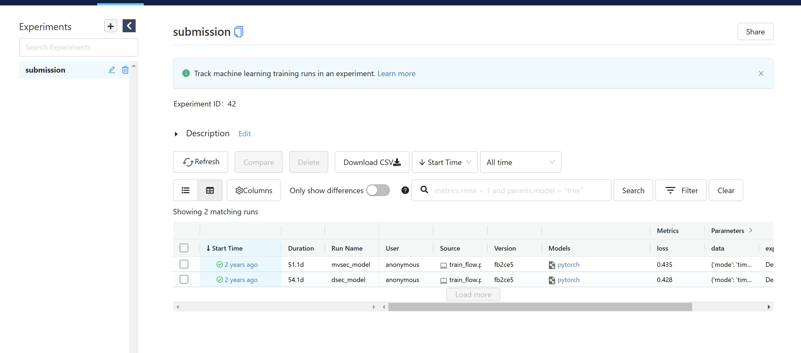
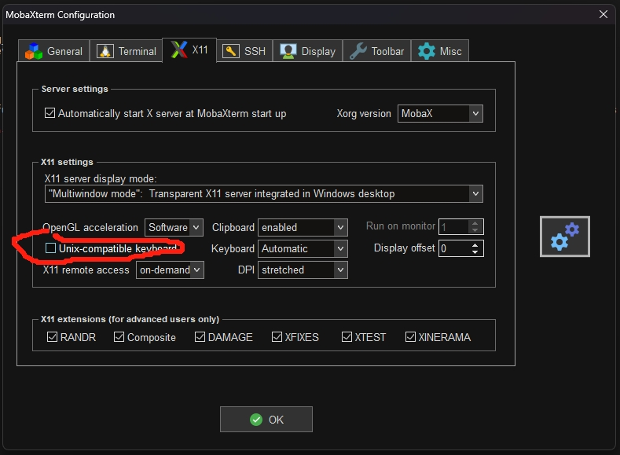
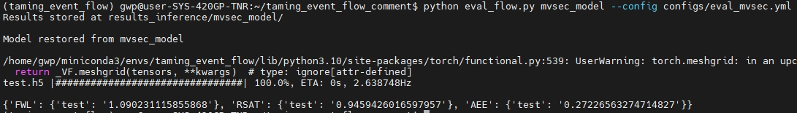
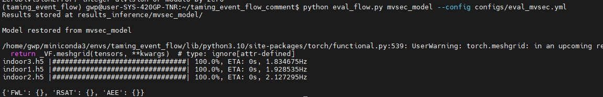
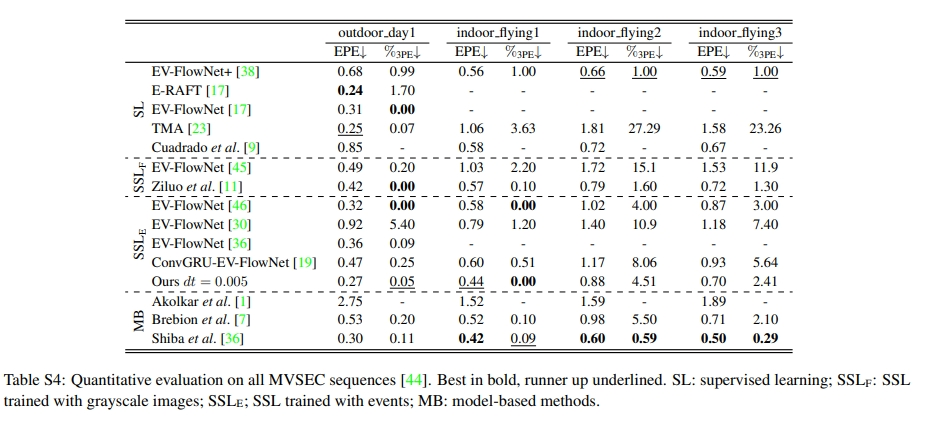
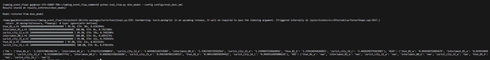

[comment]: <> 

<h1 align="center"> Taming Contrast Maximization for Learning Sequential Event-based Optical Flow Estimation
</h1>

[comment]: <> (  <h2 align="center">PAPER</h2>)
  <h3 align="center">
  <a href="https://kwanwaipang.github.io/Taming-Contrast-Maximization/">Blog</a> 
  | <a href="https://arxiv.org/pdf/2303.05214">paper</a>
  | <a href="https://github.com/tudelft/taming_event_flow">Original Github Page</a>
  </h3>
  <div align="justify">
  </div>

<br>

# 配置
* 原版采用pyenv来管理python虚拟环境的，此处改为conda

```bash

conda create -n taming_event_flow python=3.10.11
# conda remove --name taming_event_flow --all
conda activate taming_event_flow

# 安装系列依赖
pip install -r requirements.txt

# pip install qtconsole
```

# 数据的下载

* [here](https://1drv.ms/u/s!Ah0kx0CRKrAZjxMxBx4z5HN1CjWv?e=UiayaL) 并且将数据下载到 `/datasets/`文件夹内.
* 用OneDrive下载数据参考[Link](https://kwanwaipang.github.io/File/Blogs/Poster/ubuntu%E5%91%BD%E4%BB%A4%E8%A1%8C%E4%B8%8B%E8%BD%BD%E6%95%B0%E6%8D%AE.html#onedrive)

# 预训练模型的下载
* [here](https://1drv.ms/u/s!Ah0kx0CRKrAZjxSwx8-UTUAncgg3?e=yM2g0i), 并放在文件夹 `mlruns/`.

# 采用MLflow来可视化
```bash
conda activate taming_event_flow
mlflow ui
```
然后本地网页打开`http://127.0.0.1:5000`即可看到界面如下

<div align="center">
  
<figcaption>  
</figcaption>
</div>

而将下载的模型解压后，则可视化如下：

<div align="center">
  
<figcaption>  
</figcaption>
</div>


# Inference
* 注意需要修改`config/eval_flow.yml`文件中的数据等参数

## 运行测试MVSEC

```bash
conda activate taming_event_flow
python eval_flow.py mvsec_model --config configs/eval_mvsec.yml
```
初始运行可能存在下面的报错
```bash
model_loaded = torch.load(model_dir, map_location=device).state_dict()
  File "/home/gwp/miniconda3/envs/taming_event_flow/lib/python3.10/site-packages/torch/serialization.py", line 1470, in load
    raise pickle.UnpicklingError(_get_wo_message(str(e))) from None
_pickle.UnpicklingError: Weights only load failed. This file can still be loaded, to do so you have two options, do those steps only if you trust the source of the checkpoint. 
        (1) In PyTorch 2.6, we changed the default value of the `weights_only` argument in `torch.load` from `False` to `True`. Re-running `torch.load` with `weights_only` set to `False` will likely succeed, but it can result in arbitrary code execution. Do it only if you got the file from a trusted source.
        (2) Alternatively, to load with `weights_only=True` please check the recommended steps in the following error message.
        WeightsUnpickler error: Unsupported global: GLOBAL models.model.RecEVFlowNet was not an allowed global by default. Please use `torch.serialization.add_safe_globals([RecEVFlowNet])` or the `torch.serialization.safe_globals([RecEVFlowNet])` context manager to allowlist this global if you trust this class/function.

Check the documentation of torch.load to learn more about types accepted by default with weights_only https://pytorch.org/docs/stable/generated/torch.load.html.
```
解决方法则是修改`utils/utils.py`中的代码为下面即可
```python
# model_loaded = torch.load(model_dir, map_location=device).state_dict()
model_loaded = torch.load(model_dir, map_location=device, weights_only=False).state_dict()
```

之后又遇到报错需要用MobaXterm才可以可视化运行，但会遇到下面错误
```bash
/home/gwp/miniconda3/envs/taming_event_flow/lib/python3.10/site-packages/torch/functional.py:539: UserWarning: torch.meshgrid: in an upcoming release, it will be required to pass the indexing argument. (Triggered internally at /pytorch/aten/src/ATen/native/TensorShape.cpp:3637.)
  return _VF.meshgrid(tensors, **kwargs)  # type: ignore[attr-defined]
test.h5 |                                | 0.1%, ETA: 5556s, 0.163452HzASSERT: "false" in file qasciikey.cpp, line 501
Aborted (core dumped)
```
网上资料说的是`A workaround in MobaXterm is to uncheck "Unix-compatible keyboard" in X11 settings.`

进入软件左上角找到settings->configuration->X11，去除Unix-compatible keyboard前面的选项（不能勾选它）
<div align="center">
  
<figcaption>  
</figcaption>
</div>
即可~

视频效果（请见blog）
* 测试mvsec outdoor driving（应该是outdoor driving day 1）；PS: 视频中依次为：输入的事件，GT光流（Lidar），IWE，估算的光流，AEE（暂时还未知是什么）

<div align="center">
  
<figcaption>  
</figcaption>
</div>

* 测试mvsec indoor flying 数据集

<div align="center">
  
<figcaption>  
同时运行多个数据集的话可能不保存数值结果。。。。
</figcaption>
</div>

关于在mvsec上的测试，值得一提的是，作者在论文中提到`we decided to transfer one of our models trained on DSEC-Flow to MVSEC.`也就是说网络是在DSEC上训练的，迁移到MVSEC上测试（可见还是有不错的泛化能力的）。
论文中的结果如下图所示：
<div align="center">
  
<figcaption>  
</figcaption>
</div>

## 运行测试DSEC
```
conda activate taming_event_flow
python eval_flow.py dsec_model --config configs/eval_dsec.yml
```

* 测试dsec

<div align="center">
  
<figcaption>  
</figcaption>
</div>
