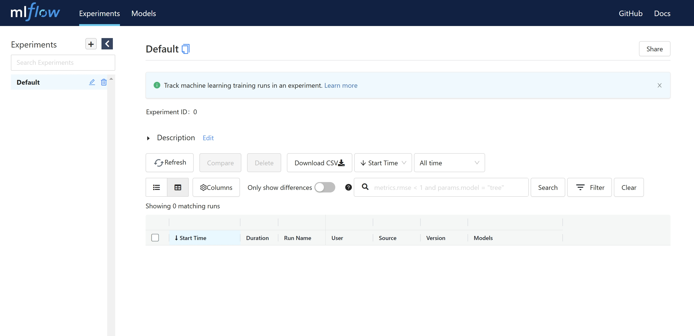

[comment]: <> 

<h1 align="center"> Taming Contrast Maximization for Learning Sequential Event-based Optical Flow Estimation
</h1>

[comment]: <> (  <h2 align="center">PAPER</h2>)
  <h3 align="center">
  <a href="https://kwanwaipang.github.io/Awesome-Event-based-Contrast-Maximization/">Blog for Awesome Event-based Contrast Maximization</a> 
  | <a href="https://arxiv.org/pdf/2303.05214">paper</a>
  | <a href="https://github.com/tudelft/taming_event_flow">Original Github Page</a>
  </h3>
  <div align="justify">
  </div>

<br>

# 配置
* 原版采用pyenv来管理python虚拟环境的，此处改为conda

```bash

conda create -n taming_event_flow python=3.10.11
# conda remove --name taming_event_flow --all
conda activate taming_event_flow

# 安装系列依赖
pip install -r requirements.txt

```

# 数据的下载

* [here](https://1drv.ms/u/s!Ah0kx0CRKrAZjxMxBx4z5HN1CjWv?e=UiayaL) 并且将数据下载到 `/datasets/`文件夹内.
* 用OneDrive下载数据参考[Link](https://kwanwaipang.github.io/File/Blogs/Poster/ubuntu%E5%91%BD%E4%BB%A4%E8%A1%8C%E4%B8%8B%E8%BD%BD%E6%95%B0%E6%8D%AE.html#onedrive)

# 预训练模型的下载
* [here](https://1drv.ms/u/s!Ah0kx0CRKrAZjxSwx8-UTUAncgg3?e=yM2g0i), 并放在文件夹 `mlruns/`.

# 采用MLflow来可视化
```bash
conda activate taming_event_flow
mlflow ui
```
然后本地网页打开`http://127.0.0.1:5000 `即可看到界面如下

<div align="center">
  
<figcaption>  
</figcaption>
</div>
